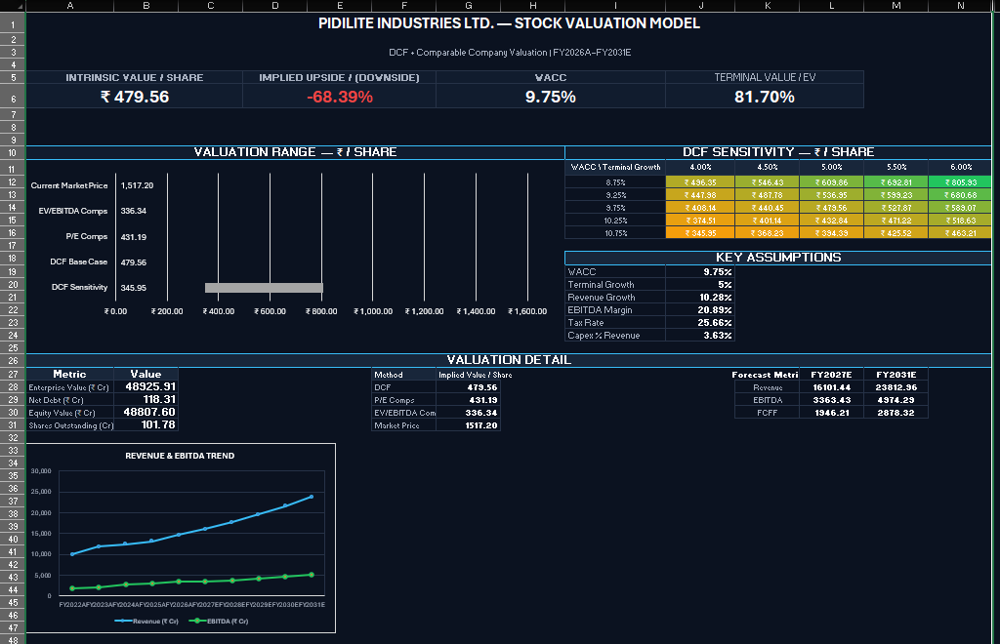

# Pidilite Industries Ltd. — Stock Valuation Model

A professional DCF and Comparable Company Valuation model for Pidilite Industries Ltd., built in Excel.

## Project Overview

This project evaluates Pidilite Industries Ltd. using two primary valuation approaches:

- Discounted Cash Flow (DCF)
- Comparable Company Valuation

The model includes historical financial analysis, operating forecasts, FCFF valuation, WACC/CAPM assumptions, terminal value analysis, sensitivity analysis, and peer-based valuation.

## Dashboard Preview

## Workbook Structure

| Sheet | Purpose |
|---|---|
| Inputs | Key operating and valuation assumptions |
| Historicals | FY2022–FY2026 historical financial analysis |
| Forecast | FY2027E–FY2031E operating forecast and FCFF |
| DCF | DCF valuation, terminal value and sensitivity analysis |
| Comps | Comparable-company valuation |
| Output | Valuation summary and supporting analysis |
| Dashboard | Executive valuation dashboard |

## Valuation Methodology

### 1. Historical Analysis

Historical financial performance is analysed for FY2022–FY2026, including:

- Revenue
- Revenue growth
- EBITDA
- EBITDA margin
- EBIT
- EBIT margin
- Tax rate
- PAT
- Working capital
- Change in NWC

### 2. Forecast

The model forecasts FY2027E–FY2031E using key operating assumptions for:

- Revenue growth
- EBITDA margin
- D&A
- Tax
- Capex
- Change in NWC

FCFF is calculated as:

FCFF = EBIT × (1 − Tax Rate) + D&A − Capex − Change in NWC

### 3. DCF Valuation

The DCF uses:

- WACC: 9.75%
- Terminal Growth: 5.00%
- Forecast period: FY2027E–FY2031E

Terminal value is calculated using the Gordon Growth Method.

### 4. Comparable Company Valuation

The peer set consists of:

- Jyoti Resins
- Nikhil Adhesives
- HP Adhesives
- Hindustan Adhesive

The analysis uses:

- P/E
- EV/EBITDA

Peer median multiples are applied to Pidilite's relevant financial metrics to derive implied valuation.

## Key Valuation Outputs

| Metric | Value |
|---|---:|
| DCF Intrinsic Value / Share | ₹479.56 |
| Current Market Price | ₹1,517.20 |
| DCF Sensitivity Range | ₹345.95 – ₹805.93 |
| P/E Implied Value / Share | ₹431.19 |
| EV/EBITDA Implied Value / Share | ₹336.34 |
| WACC | 9.75% |
| Terminal Growth | 5.00% |

## Data Sources

Historical financial information:
Pidilite Industries Ltd. Annual Reports and financial disclosures.

Comparable-company data:
Value Research peer comparison data, dated 04-Sep-2026.

Risk-free rate:
CCIL tenor-wise indicative yields.

Market return:
Nifty 50 10-year annualised Price Return data.

## Project Progress

### Day 1 — Historical Analysis
- Historical financial data collected
- FY2022–FY2026 historical analysis completed
- Revenue, EBITDA, EBIT, PAT and working-capital metrics calculated

### Day 2 — Forecast & DCF Foundations
- Operating assumptions established
- WACC/CAPM framework completed
- Forecast model built
- FCFF calculation completed

### Day 3 — DCF Valuation
- DCF valuation completed
- Terminal value calculated
- Enterprise value and equity value derived
- DCF sensitivity analysis completed

### Day 4 — Comparable Valuation & Output
- Peer set established
- P/E and EV/EBITDA multiples analysed
- Peer median multiples calculated
- Pidilite implied valuation completed
- Output sheet completed

### Final Stage — Dashboard & Presentation
- Executive dashboard completed
- Valuation summary and sensitivity visualisation completed
- Workbook formatting and presentation layer finalised

## Disclaimer

This project is for educational and portfolio purposes only and does not constitute investment advice or a recommendation to buy or sell securities.
